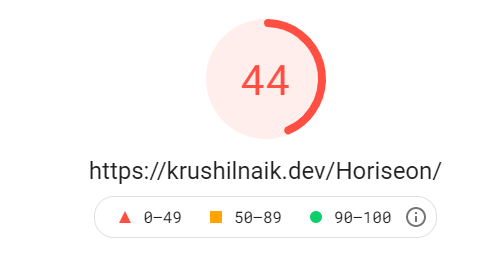
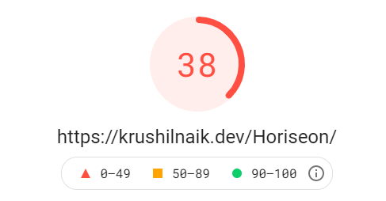
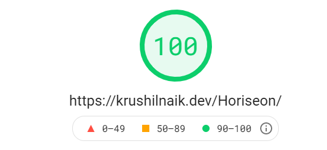
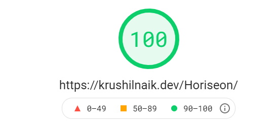
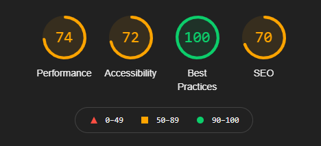
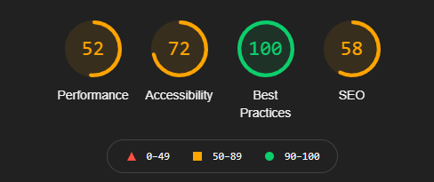
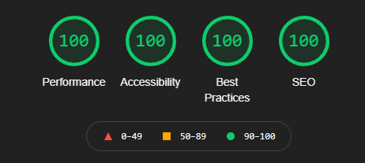
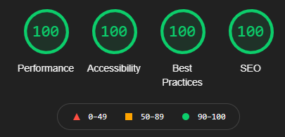

# Horiseon

The first assignment for the Rutgers coding bootcamp: optimizing the landing page of a hypothetical SEO firm.

## Table of Contents
[Tasks](#tasks)

[The Results](#the-results)

[The How](#the-how)

[Possible Improvements](#possible-improvements)

## Tasks
-  From bootcamp:
   -  [x] Ensure some form of 508 Compliance
   -  [x] Improve DRYness
   -  [x] ~~Ironic~~ SEO
-  From myself:
   -  [x] Asset and delivery optimization

## The Results

### PageSpeed Insights scores before optimization... 💀

|                          Desktop                          |                         Mobile                          |
| :-------------------------------------------------------: | :-----------------------------------------------------: |
|  |  |

### ... and after 😍

|                          Desktop                           |                          Mobile                          |
| :--------------------------------------------------------: | :------------------------------------------------------: |
|  |  |

---

### Chrome Lighthouse scores before optimization... 👀

|                          Desktop                           |                          Mobile                          |
| :--------------------------------------------------------: | :------------------------------------------------------: |
|  |  |

### ... and after 😍

|                           Desktop                           |                          Mobile                           |
| :---------------------------------------------------------: | :-------------------------------------------------------: |
|  |  |

---

## The How

-  The images were shrunken down to their CSS-defined max widths/heights to prevent unnecessary down-scaling.

   -  NOTE: Since this is still an assignment to be graded by a human, minification of code will be skipped

-  35% of `./assets/css/styles.css` was found to be redundant so I cut those out, consolidating elements with mostly similar properties where sensible.
   -  NOTE: Higher mobile scores (and beauty in general) can be achieved by making the site responsive, but we haven't covered that yet. I'll come back and implement this later

---

## Possible improvements:

-  Network analyses show an abysmal render time (~17s) on "Slow 3G" throttling. I figure this is to be expected, but if anyone can think of a way to speed this up, let me know or submit a pull request! 👍
